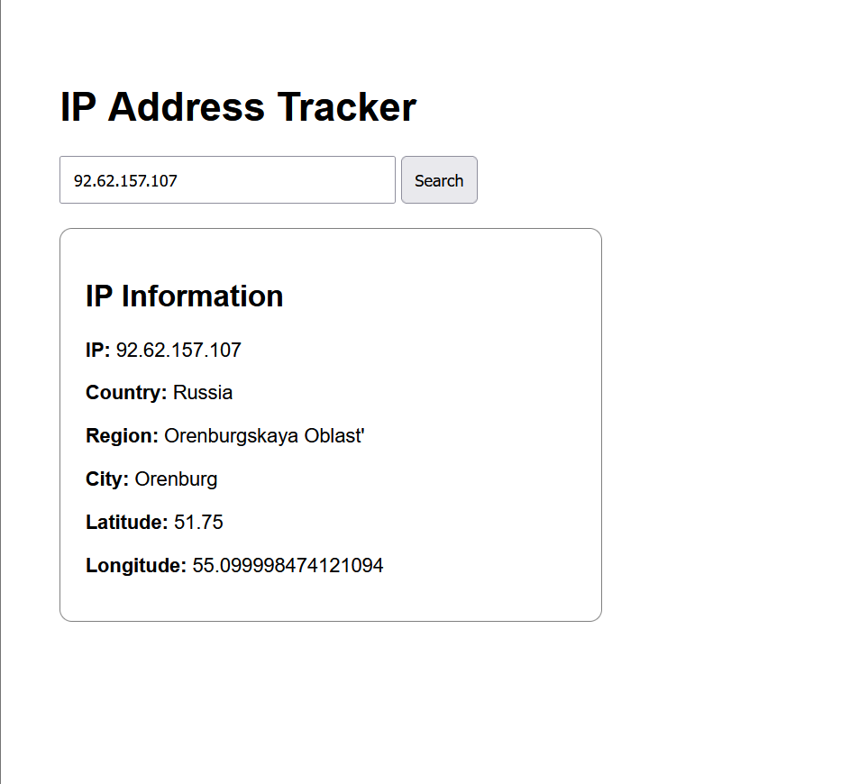

# IP Address Tracker

A small full-stack project that tracks IP address information using the IPStack API.

The purpose of this project is to build a foundation.

This project demonstrates how a frontend communicates with a backend server, and how the backend forwards requests to a public API(using axios) and returns the response back to the frontend.

---

# Project Preview




---

# Features

- Search information about any IP address
- Backend proxy server using Express.js
- Fetch data from IPStack API
- Display IP details on frontend
- Request logging
- Uses GET requests
- Handles CORS
- Environment variable support using dotenv

---

# Project Flow

```text
Frontend (Browser)
        ↓
Express Backend Server
        ↓
IPStack Public API
        ↓
Backend sends response
        ↓
Frontend displays data
```

---
